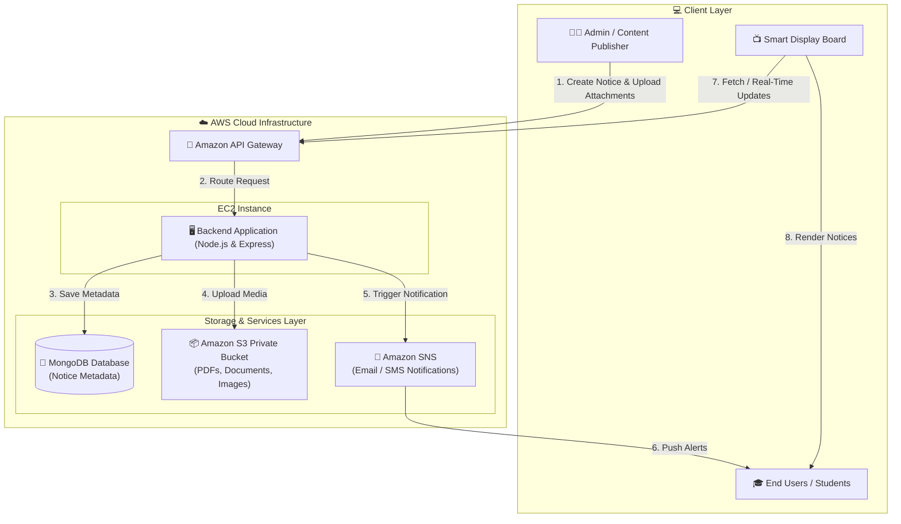
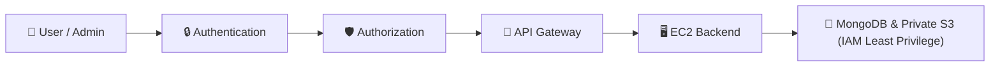

# 📢 Smart Notice Board System (AWS Enterprise Edition)

[](LICENSE)
[](https://nodejs.org/)
[](https://aws.amazon.com/)
[](https://www.mongodb.com/)
[](https://github.com/aurox01/enterprise-notice-board)

A cloud-native, real-time **Digital Notice Board System** deployed on AWS infrastructure. Designed for educational institutions, corporate campuses, and enterprise environments, this platform enables seamless creation, management, real-time dissemination, and secure delivery of announcements to smart digital displays and mobile/email subscribers.

---

## 🏗️ System Architecture

The Smart Notice Board System relies on a scalable and secure cloud architecture built on **Amazon Web Services (AWS)** and **MongoDB**.



---

## 🔄 End-to-End Workflow

```
Admin ──► Web Admin Panel ──► API Gateway ──► Backend on EC2
                                                   │
                ┌──────────────────────────────────┼──────────────────────────────────┐
                ▼                                  ▼                                  ▼
      MongoDB (Metadata)                   S3 (Files)                       SNS (Notifications)
                │                                  │                                  │
          Notice Data                         Images/PDFs                        Email/Message
                └──────────────────────────────────┴──────────────────────────────────┘
                                                   │
                                                   ▼
                                          Smart Display Board
                                                   │
                                                   ▼
                                            Users / Students
```

### 1. 📝 Notice Creation
The administrator logs into the **Web Admin Panel** and inputs notice details:
* **Title & Description**
* **Publish & Expiry Dates**
* **Department / Category Filter** (e.g., Computer Science, Administration, Events)
* **Priority Level** (Low, Medium, High)
* **Media Attachments** (Images, PDF circulars, documents)

### 2. 🚪 API Gateway Processing
* The Web Admin Panel transmits HTTP requests to **Amazon API Gateway**.
* API Gateway serves as the secure front door, managing traffic, request validation, rate limiting, and routing incoming traffic to the backend infrastructure.

### 3. 🖥️ Backend Processing (Amazon EC2)
* The core Node.js/Express application runs on an **Amazon EC2** instance.
* Upon receiving a payload, the server:
  1. Validates the request body and authorization headers.
  2. Extracts metadata and binary media attachments.
  3. Prepares file storage payloads and database entry models.

### 4. 🍃 Metadata Storage (MongoDB)
Structured information is securely written to **MongoDB**:
* Notice ID, Title, & Content body
* Department classification & Author details
* Timestamp metadata (`createdAt`, `isActive`)
* S3 Document URI / reference links

### 5. 📦 File Storage (Amazon S3 Private Bucket)
* Attachments (Images, PDFs, documents) are stored in an **Amazon S3** private bucket.
* Direct public access to S3 objects is blocked. Access is served via secure backend signed URLs or restricted API proxies.
* **Separation of Concerns:** MongoDB manages lightweight structured data while S3 handles heavy static asset storage.

### 6. 🔔 Push Notifications (Amazon SNS)
* Once a notice is successfully published, the backend invokes **Amazon Simple Notification Service (Amazon SNS)**.
* SNS fans out push messages and emails to subscribed students, faculty, or department distribution lists.

### 7. 📺 Real-Time Display & User Access
* Digital smart display boards installed across the campus fetch active notices via API Gateway/Socket.io.
* Display boards update automatically in real-time without manual intervention.

---

## 🔐 Security Architecture

Security is built into every layer following AWS best practices:



* **IAM Least Privilege:** Dedicated AWS IAM roles ensure each component only accesses required resources (e.g., EC2 can write to specific S3 buckets and publish to designated SNS topics).
* **Private S3 Buckets:** Public read access to S3 is disabled. Attachments are retrieved via signed URIs or application proxying.
* **API Gateway Protection:** Protects backend EC2 instances from direct exposure, enabling throttling, DDoS mitigation, and SSL termination.

---

## 🛠️ Technology Stack

| Component | Technology | Description |
| :--- | :--- | :--- |
| **Frontend Admin** | HTML5, CSS3, JavaScript | Web interface for managing and composing notices |
| **Digital Display** | Socket.io Client, HTML5 | Real-time auto-refreshing kiosk dashboard |
| **Backend API** | Node.js, Express.js, Socket.io | Server logic, REST APIs, and real-time websockets |
| **Database** | MongoDB | Document database for storing notice metadata |
| **API Management** | Amazon API Gateway | Secure API entry point, routing, and rate limiting |
| **Compute** | Amazon EC2 | Scalable compute instance hosting the backend application |
| **Object Storage** | Amazon S3 | Secure private bucket for media & document uploads |
| **Notifications** | Amazon SNS | Multi-channel email and push notification service |
| **Security** | AWS IAM | Granular access policy management |

---

## 📁 Repository Structure

```
enterprise-notice-board/
├── public/
│   ├── admin.html       # Web Admin Dashboard interface
│   ├── admin.js         # Admin panel logic & API requests
│   ├── display.html     # Smart Display Board kiosk UI
│   ├── display.js       # Real-time websocket display client
│   └── style.css        # Responsive styling & themes
├── server.js            # Node.js Express server & Socket.io handler
├── package.json         # Project dependencies & scripts
├── package-lock.json    # Locked dependency tree
├── .env                 # Environment variables (template)
├── .gitignore           # Git ignore rules
└── README.md            # System documentation
```

---

## ⚡ Quick Start (Local Development)

### Prerequisites
* [Node.js](https://nodejs.org/) (v18.x or higher)
* [npm](https://www.npmjs.com/) (v9.x or higher)

### Setup Instructions

1. **Clone the Repository**
   ```bash
   git clone https://github.com/aurox01/enterprise-notice-board.git
   cd enterprise-notice-board
   ```

2. **Install Dependencies**
   ```bash
   npm install
   ```

3. **Configure Environment Variables**
   Create a `.env` file in the root directory:
   ```env
   PORT=3000
   MONGODB_URI=mongodb://localhost:27017/noticeboard
   AWS_REGION=us-east-1
   AWS_S3_BUCKET_NAME=your-private-notice-bucket
   AWS_SNS_TOPIC_ARN=arn:aws:sns:us-east-1:123456789012:NoticeBoardTopic
   ```

4. **Run the Application**
   ```bash
   # Production mode
   npm start

   # Development mode (auto-reload)
   npm run dev
   ```

5. **Access the Interfaces**
   * 📺 **Smart Display Board:** `http://localhost:3000/`
   * ⚙️ **Admin Panel:** `http://localhost:3000/admin`

---

## 🌐 AWS Deployment Guide

1. **Provision EC2 Instance:** Launch an Ubuntu/Amazon Linux 2 EC2 instance inside a secure VPC subnet.
2. **Setup API Gateway:** Create an HTTP API Gateway pointing to the EC2 instance or ALB endpoint.
3. **Configure S3 Bucket:** Create an S3 bucket with **Block All Public Access** turned ON.
4. **Create SNS Topic:** Setup an Amazon SNS Topic for notice notifications and attach subscriber emails.
5. **Assign IAM Roles:** Attach an IAM Role to the EC2 instance with `AmazonS3FullAccess` (scoped to bucket) and `AmazonSNSFullAccess`.
6. **Deploy App:** Clone code onto EC2, run using `pm2` or Docker, and configure Nginx reverse proxy.

---

## 📄 License

This project is licensed under the [MIT License](LICENSE).
